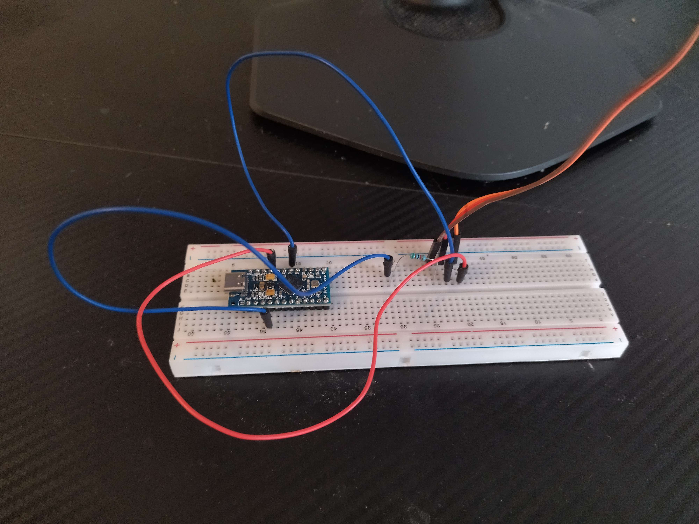
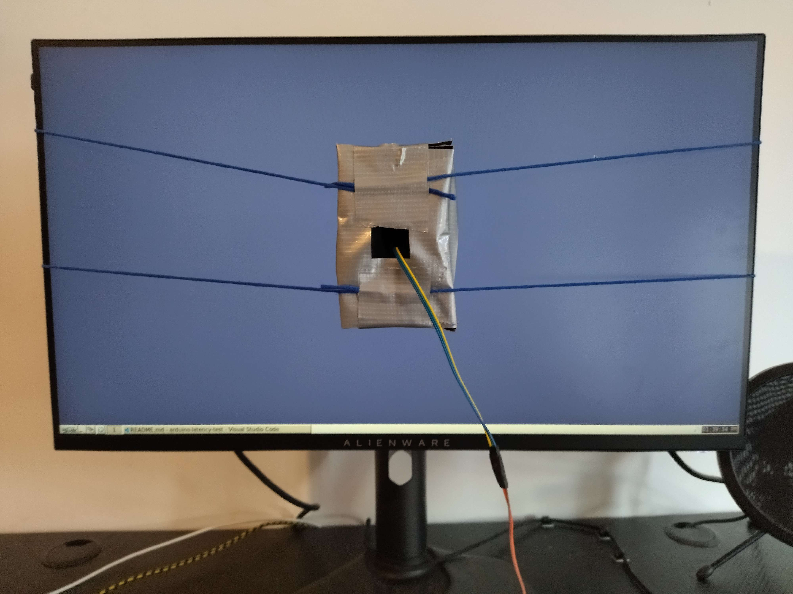

# Arduino Latency Tester

A simple input lag tester built with an Arduino-compatible ATmega32U4 board. Tested to work on both Linux and Windows.

The device sends either a simulated click or a simulated mouse movement to the PC, then measures the time it takes for the screen to change.

## How to build

I personally used an ALS-PT19 for this, but it probably works with other light sensors too (maybe requiring some firmware modifications).

Here is how to build it with an ALS-PT19 breakout board:

1. Connect the `out` terminal of the sensor to A1
2. Connect the positive terminal to VCC
3. Connect the negative terminal to GND, with a 50k resistor in between (you can use a higher resistance value if your display is especially dark or a lower value if your display is especially bright, but 50k should be fine for most purposes)
4. Place the light sensor in a container to prevent interference from ambient light, maybe with some kind of padding to prevent scratching your monitor's screen
5. Mount the sensor on your monitor (e.g. using string)

(it was my first time ever soldering anything, don't judge)

## How to use

- Install Python and the pySerial module.

- Install the device's firmware (`firmware/latencytest.ino`) using the Arduino IDE.

- Configure using settings.txt, and then start the test with the run-test script.

- Results can be visualized using the `Interval vs. Time` mode in [MouseTester v1.7](https://github.com/valleyofdoom/MouseTester/releases) (requires Wine if using Linux).

- If you are getting any results in the 0-0.5ms range, try increasing the `time_between_inputs` setting or the `threshold` setting.

- If playing with VSync off, avoid FPS values exactly equal to your monitor's refresh rate due to phase locking of the tearline.

- Don't move the sensor between tests, because different parts of your monitor will have different latency.